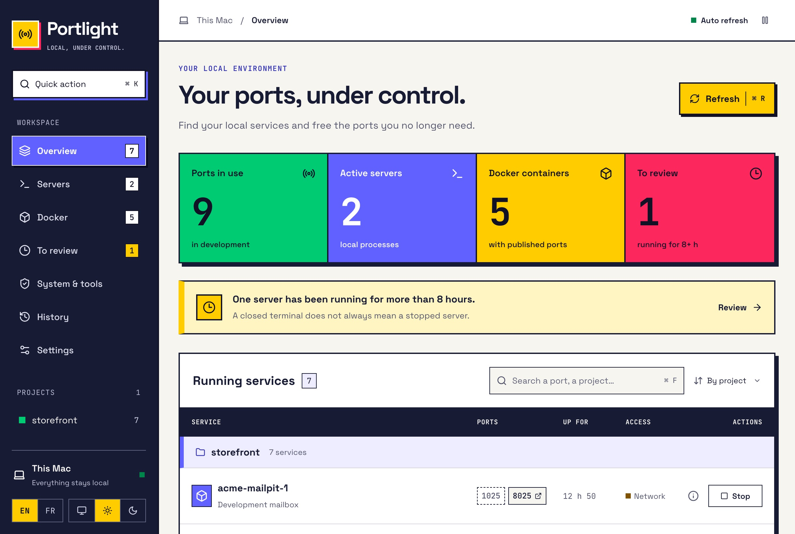

# Portlight

[](https://github.com/max-mxm/portlight/actions/workflows/ci.yml)


[](LICENSE)

Une application Mac pour retrouver les serveurs oubliés, identifier les ports utilisés et arrêter le bon processus ou conteneur.

**Tauri 2 · Rust · React · TypeScript · Vite**. Aucun serveur HTTP en production, aucun compte et aucun service cloud. Interface française, thèmes clair/sombre et typographie Space Grotesk / JetBrains Mono embarquée, interface brutaliste carrée et palette inspirée de Monday.

## Aperçu



Capture réelle de l’application macOS. Les compteurs reflètent la machine au moment de la capture. Une vue rassemble les ports, les serveurs, les conteneurs et les processus anciens à vérifier ; la recherche et les actions sont accessibles au clavier.

## Démarrer

Prérequis : **macOS 12+**, **Node.js 22+**, **Rust stable** et les **outils en ligne de commande Xcode** (`xcode-select --install`). Docker est facultatif : le moteur doit être démarré pour afficher ses conteneurs. Cette version a été validée localement sur Apple Silicon ; les autres architectures restent à vérifier.

Le dépôt est actuellement privé : le clonage nécessite un compte GitHub autorisé et une clé SSH configurée.

```sh
git clone git@github.com:max-mxm/portlight.git
cd portlight
npm ci
npm run app:dev
```

`npm run dev` lance uniquement l’interface web : elle ne peut pas inspecter ou arrêter les processus. Le port de développement Vite est `1420`, limité à localhost. Il n’est pas ouvert par l’application compilée.

## Construire l’application

```sh
npm run app:build
open src-tauri/target/release/bundle/macos/Portlight.app
```

Cette compilation locale n’est pas signée avec un certificat Developer ID ni notarisée. La distribution publique nécessitera une signature et une notarisation Apple.

Pour obtenir un relevé JSON sans ouvrir la fenêtre :

```sh
src-tauri/target/release/portlight --scan-json
```

## Utilisation

- Recherche par port, nom, PID, commande ou projet. Filtre par projet dans la barre latérale.
- Serveurs regroupés par dépôt GitHub, y compris ceux démarrés dans un worktree.
- Vue « À vérifier » : processus de développement actifs depuis au moins 8 heures. Ce seuil ne prouve pas qu’un serveur est inutilisé.
- Arrêt normal (`SIGTERM`), vérification des ports et arrêt forcé proposé après résistance constatée.
- Docker : arrêt du conteneur concerné avec `docker stop --time 5`, jamais du moteur Docker.
- Ouvrir un port dans le navigateur (HTTP) et copier sa commande d’arrêt dans les détails.
- Historique des 50 dernières actions, stocké localement. Pause de l’actualisation et thèmes clair/sombre.
- `⌘K` : actions rapides. `⌘F` : recherche. `⌘R` : actualisation.

## Fonctionnement

1. Rust collecte les ports TCP en écoute avec `lsof` et `netstat`, puis enrichit les processus avec `ps`. Si Docker est disponible, ses ports publiés sont associés aux conteneurs.
2. L’interface reçoit un inventaire via les commandes IPC de Tauri. Elle regroupe les services par projet et permet de chercher un port ou un processus.
3. Un arrêt demande confirmation. Le backend relit l’inventaire et revalide la cible avant de lui envoyer `SIGTERM`, ou de stopper le conteneur Docker concerné.
4. Portlight vérifie si les ports sont libérés. Pour un processus qui résiste à l’arrêt normal, une action forcée devient disponible.

Les signaux sont exécutés par Rust ; aucune commande fournie par l’interface n’est interprétée par un shell. Le thème et l’historique restent dans le stockage local de l’application. Il n’y a pas de télémétrie, de compte ou de backend distant. Le frontend compilé et les polices sont embarqués dans l’application.

## Architecture

- `src-tauri/src/scan.rs` : inventaire TCP via lsof + netstat, classification et projets.
- `src-tauri/src/docker.rs` : conteneurs, ports publiés, métadonnées Compose et durée.
- `src-tauri/src/actions.rs` : validation fraîche de la cible, signaux et vérification après arrêt.
- `src-tauri/src/process.rs` : exécution sans shell, délais et métadonnées de processus.
- `src-tauri/src/lib.rs` : commandes IPC typées, travail système exécuté hors du thread UI.
- `src/` : interface, recherche, groupes, raccourcis, dialogues et historique.
- `docs/design-decisions.md` : adaptation du système UI UX Pro Max au contexte Mac.

## Limites explicites

Cette première version recense les **ports TCP en écoute**, pas tous les sockets UDP ni les connexions sortantes. Sans privilèges administrateur, certaines métadonnées système peuvent être absentes. Les services macOS, les IDE, les émulateurs et les processus d’autres utilisateurs sont protégés ; l’arrêt depuis l’interface est réservé aux processus de développement reconnus appartenant à l’utilisateur et aux conteneurs.

La vérification de l’identité d’un processus utilise son PID et sa date de démarrage fournie par `ps` (précision à la seconde), avec une nouvelle vérification avant le signal ; elle réduit le risque de réutilisation du PID sans fournir la garantie atomique d’un handle de processus. Un superviseur peut relancer un processus : si le port reste occupé après l’arrêt, Portlight le signale.

Pas de service en arrière-plan ni de lancement automatique à la connexion dans cette version. L’actualisation est effectuée toutes les 10 secondes pendant que la fenêtre est visible. L’historique provient seulement des actions effectuées dans Portlight, pas d’une surveillance permanente du système.

## Vérifications

```sh
npm run build
npm test
npm run format:check
cargo fmt --manifest-path src-tauri/Cargo.toml -- --check
cargo test --manifest-path src-tauri/Cargo.toml
cargo clippy --manifest-path src-tauri/Cargo.toml --all-targets -- -D warnings
```

Le test d’intégration Rust démarre uniquement son propre serveur Node sur un port éphémère : il vérifie l’identité périmée, la résistance à SIGTERM, SIGKILL et la libération du port. Il n’arrête aucun service préexistant.

## Contribuer

Les conventions et les étapes de validation sont décrites dans [CONTRIBUTING.md](CONTRIBUTING.md). Les choix visuels sont documentés dans [docs/design-decisions.md](docs/design-decisions.md). La CI exécute les vérifications frontend et Rust sur macOS à chaque push et pull request.

## Licence

Le code de Portlight est distribué sous [licence MIT](LICENSE), © 2026 Maxime MxM. Le statut privé du dépôt ne modifie pas la licence du code. Les dépendances conservent leurs licences respectives ; les licences des polices embarquées figurent dans [THIRD_PARTY_NOTICES.md](THIRD_PARTY_NOTICES.md).

La palette est inspirée de Monday ; Portlight est un projet indépendant, sans affiliation avec Monday.
